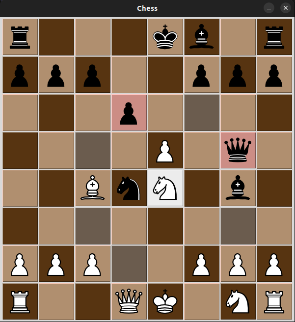

# Chess

This application is written in Python with tkinter.

### Instructions for use

1. Install [poetry](https://python-poetry.org/)

2. Install [direnv](https://direnv.net/)

3. Create *.env.local* use *.env.example*

4. Allow direnv. `allow direnv`

5. Install dependencies. `poetry install`

6. Start application. `chess`

### Screenshots

